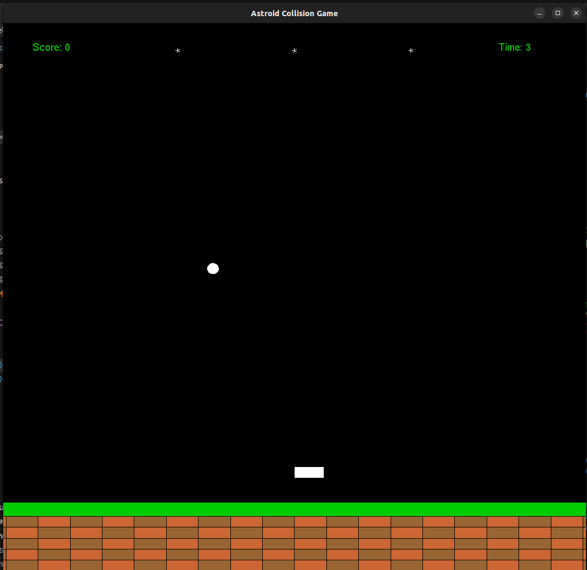

# Asteroid Collision Game

## Project Description
This project is a fun and interactive game where players navigate through space and avoid colliding with asteroids. The game is built using C++ and can be compiled and run using CMake.

## Installation

### Prerequisites
- CMake version 3.22.1
- C++ (Ubuntu 11.4.0-1ubuntu1~22.04) 11.4.0

### Steps
1. Clone the repository
```bash
git clone https://github.com/ishworrsubedii/asteroid_collision_game_2d_opengl.git
```

2. Navigate to the project directory
```bash
cd asteroid-collision-game

```
3. Create a build directory and navigate to it

```bash
mkdir build && cd build
```

4. Create a build directory and navigate to it

```bash
cmake ..
```
5. Create a build directory and navigate to it

```bash
make

```

## File Structure
```
.
├── assets
├── build
├── include
│   └── game.h
├── lib
├── tests
├── src
│   ├── game.cpp
│   ├── main.cpp
├── CMakeLists.txt
└── README.md
```
## Interface(UI)



## Usage
After compiling the project, you can run the game with the following command:

```bash
./AsteroidCollisionGame
```


## Contributing
Pull requests are welcome. For major changes, please open an issue first to discuss what you would like to change.